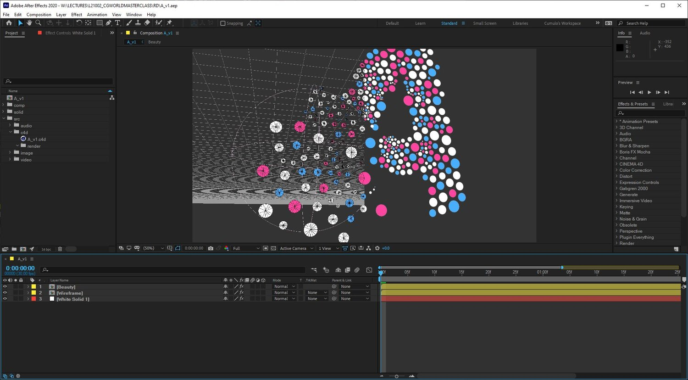
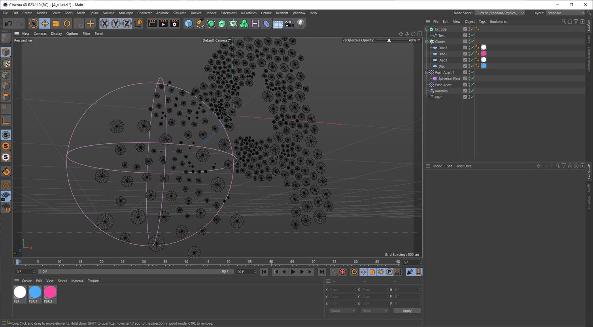

3月20日(土)に開催される、CGWORLD MASTERCLASS ONLINE vol.3に登壇します。

> 2DモーショングラフィックスはAfter Effectsで作ることが多いですが、制約が多く、目的の表現にたどり着くのに苦労する場面が多々あります。
>
> 特に、たくさんの図形を配置して動かしたいとき・立体的なシーン展開をしたいときなどにCinema 4Dを使うことで素早く効果的な表現を作成できます。
>
> この講座では、テクスチャやマテリアルを作り込む3DCGではなく、2Dモーショングラフィックスを作成するためのツールとしてCinema 4Dを活用する方法を、実例を交えながらご紹介します。
