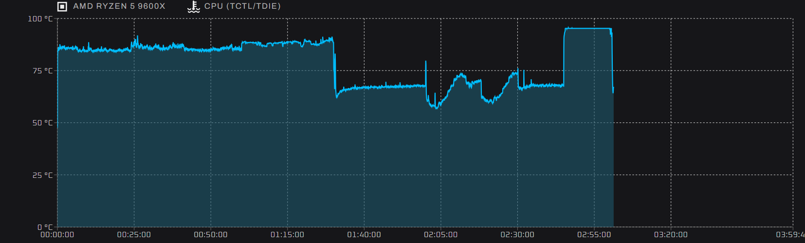
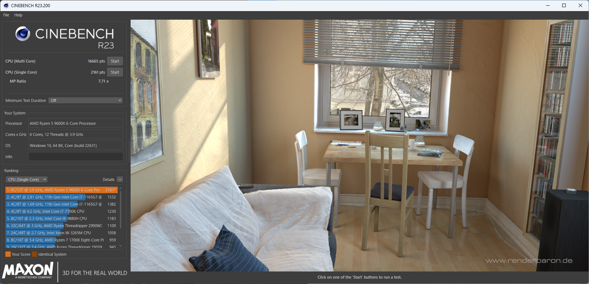
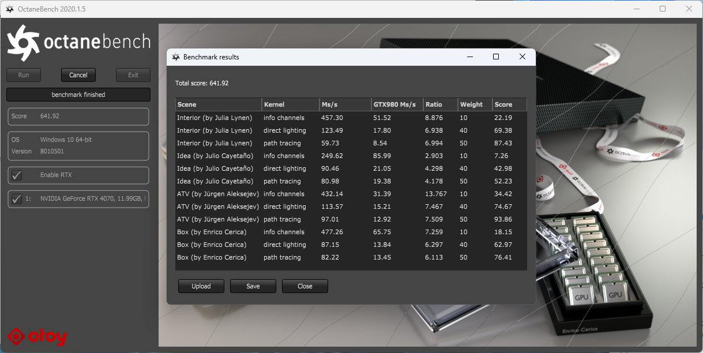
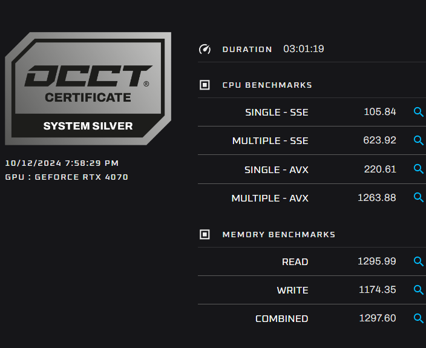

## スペック

```plaintext
CHA : Jonsbo TK-0 black
CPU : AMD Ryzen 5 9600X
CPU_FAN: Noctua NH-D9L chromax.black
M/B : ASUS ROG STRIX B650E-I GAMING
RAM : Micron W5U4800CM-32GS 64GB (2x 32GB DDR5-4800MHz)
GPU : ASUS DUAL GeForce RTX 4070 EVO OC Edition 12GB GDDR6X
SSD : Nextorage 2000GB NN4LE-2TB2CN/GNE
PSU : Cooler Master V750 SFX Gold ATX3.0
CHA_FAN : Arctic P14 PWM
```

## ポイント

### ケース

最近登場した、Jonsbo TK-0を採用。前回組んだTK-1に比べると、かなり小さい。

(240mmラジエーターとかも入らないサイズ感)

木の質感はかなり良い。

ガラスは少しスモークのかかった感じで、すべて光らないパーツで構成すると、かなり落ち着いた雰囲気になる。


### CPUとCPUファン

Ryzen 5なので、NH-D9Lで十分冷やせそう。(10分負荷で85℃程度)

NH-U12Sはケースに入らないので、Ryzen 7以降は厳しいかもしれない。



### GPU

ケースに入るサイズで、デザイン性も良好だったASUSのRTX 4070にした。

### エアフロー

横置きになるので、エアフローはちょっと難しい。

本当はいろいろ検証したいところだったが、とりあえず内向きに140mmファンを配置して、CPUファンに新鮮な空気が入るようにしてみた。

これだと、負荷時でも天面のガラスが熱くなる感じは無かった。


## ベンチマーク

### Cinebench R23

CPU (Multi Core): 16665 pts

CPU (Single Core): 2161 pts



### Octane Bench

Score: 641.92 pts



### OCCT



