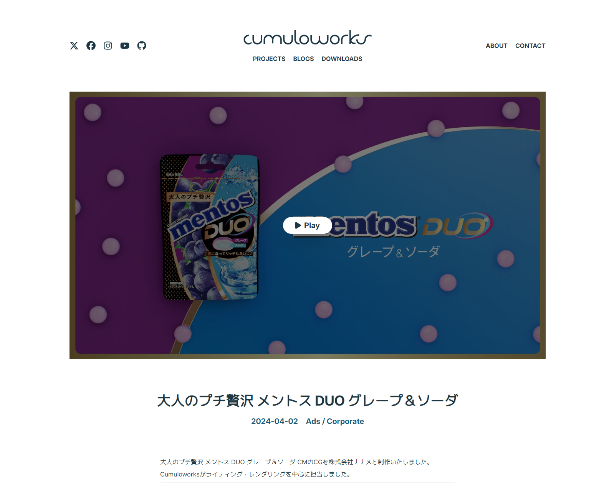
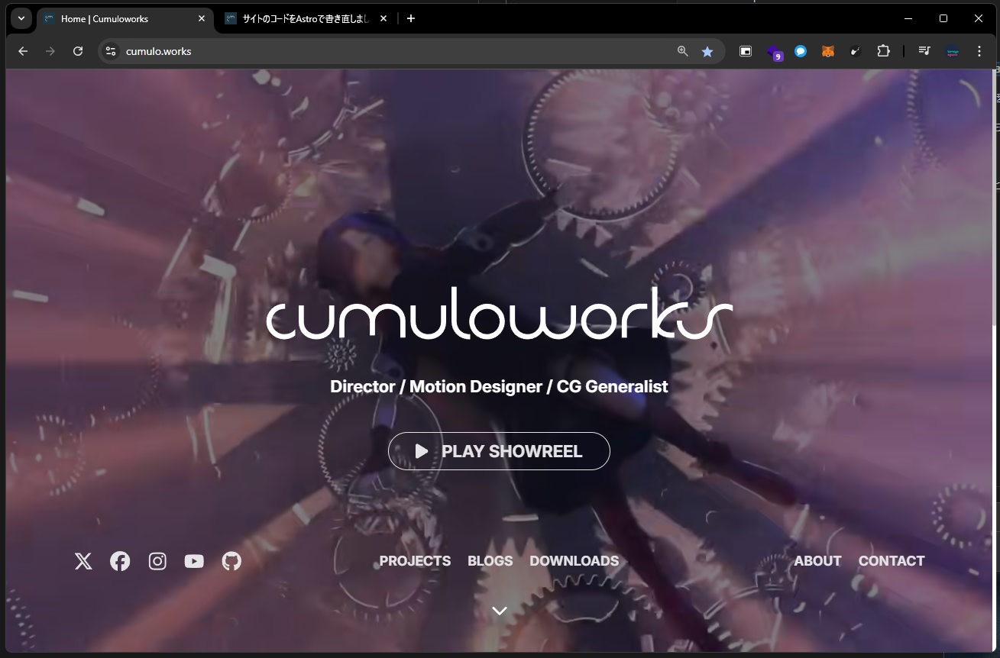
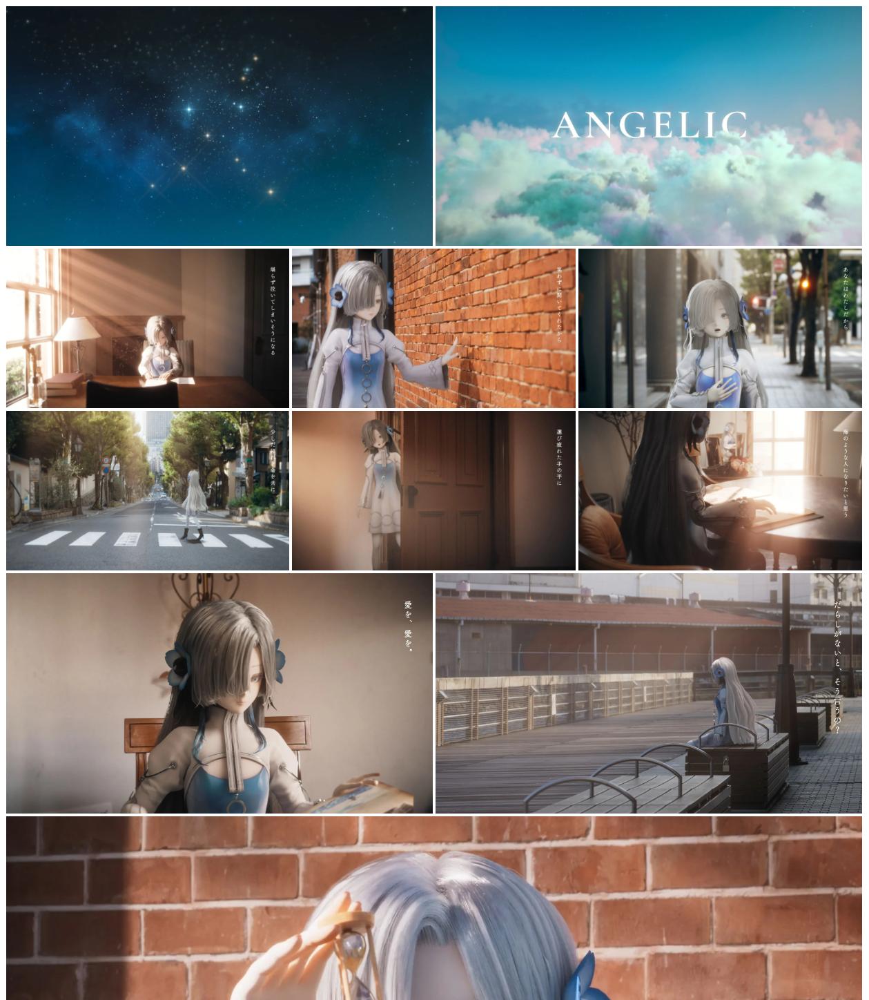
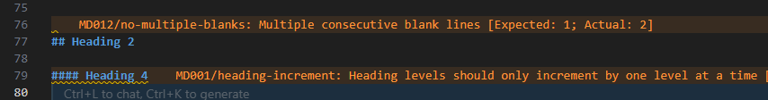

## Webサイトをリニューアルしました

今までも色々とサービスを乗り換えたり(e.g. WordPress, Squarespace)、Next.jsで作ってみたりしてきたが、ようやく納得できる形に出来たのでしばらくはこれで落ち着きそう。

>⚠️⚠️⚠️ 以下は、技術記事というよりは個人の感想・日記みたいなものだと思ってお読みください。当然、正確性だとか、妥当性だとかは全く保証できません。

<hr>

## 主な変更点

### 1. Next.jsからAstroに移行

このポートフォリオサイトは、新しいプロジェクトを月に1回追加する程度の更新頻度で、これまでのNext.js+CMSの構成は複雑すぎると感じていた。

もはや静的なHTMLでも良いくらいだと思ったりもしたが、画像の自動最適化やコンポーネントの使用など最低限の機能は欲しかった。

Astroを使うと、シンプルなHTMLから徐々にコンポーネント化や最適化を行っていけるらしい&Markdownで記事を書いていくのに向いているらしいということを知り、1週間弱かけてコードをイチから書き直した。

(あと、Astroは最近名前をよく聞くので、ずっと試してみたかった。ポートフォリオはちょうどいい題材になると思った。)

### 2. 記事データをCMSからGitHub・Markdownに移行

これまでCMSとしては[microCMS](https://microcms.io/)というサービスを利用していたが、エディタが自分の好みではなかったり、画像データがアップしづらかったりと、若干のストレスがあった。

ちょうど仕事の資料の管理もGitHub・Markdownで統一してきているところだったので、ポートフォリオのコンテンツも同様に管理できたら一番良いと思った。

## 完成したWebサイトの構成

### [GitHubリポジトリへのリンク](https://github.com/cumuloworks/cumuloworks)

### 構成(抜粋)

```plaintext
src/
├── components/ -> Astroのコンポーネント
├── content/
│   ├── blogs/
│   ├── downloads/
│   └── projects/ -> 各プロジェクトの記事
│       ├── slug/ -> slug.mdで使う画像ファイルなど
│       │   ├── thumb.jpg -> サムネイル
│       │   ├── 01.jpg
│       │   ├── 02.jpg
│       │   └── 03.jpg -> ギャラリーで表示されるファイル
│       └── slug.md -> 記事のMarkdown
└── pages/ -> 各ページのコード
    ├── [base]/
    │   ├── [...slug].astro -> 各記事のページ
    │   └── index.astro -> 各ベースカテゴリのページ(記事一覧)
    ├── privacy.md -> シンプルなレイアウトのページは直接Markdownで記述。
    ├── about.astro -> Aboutページ。
    └── index.astro -> トップページ。
```

今回の更新で、各記事・画像ファイルとWebサイトのコードを1つのリポジトリで管理できるようになり、デプロイが楽になった。

これまでの、CMSで記事更新 → Vercelでリビルド・デプロイというプロセスが不要になり、サイトの構造変更であっても記事の更新であってもGitHubへのPushで完結できるようになった。

記事自体も自分の好みのエディターで書けるし、必要に応じてHTMLをMarkdownに埋め込むことも出来る。

### 移行プロセス

#### microCMSのデータの取得

MicroCMSからデータをエクスポートする方法は公式に用意されていないが、[microcms-backup-tool](https://github.com/Sinhalite/microcms-backup-tool)を使うことでJSONとメディアを取得できた。

その後、Astroの構成に合わせて、

1. すべての記事が1つになったJSONから、記事ごとのMarkdownに変換
1. Markdownのfrontmatterにタイトル・説明文・日付・ベースカテゴリを記述
1. 画像ファイルを記事と紐づけてフォルダ分けする

というNode.jsのスクリプトを書いて一括処理した。

(一応、`/src/(tools)/microcms-convert/`に変換に使ったスクリプトがある。)

#### Markdownの内容

astro.config.mjsに設定をしておくことで、`/src/content/`内のファイルを記事として取得して、CMS的に使える。

Markdownは、冒頭にfrontmatterでメタデータを記述しておく。

```markdown
---
title: "記事タイトル"
description: "記事の短い説明"
date: "2024-09-23"
category: "Technology / Tips"
---

## Heading 2

Paragraph...
```

各メタデータは、記事取得時にオブジェクトになって返ってくるので、ソート・カテゴライズに使ったり、表示に使ったりできる。

## 軽量化

### SSG

`astro.config.mjs`に

```javascript
 output: "static"
```

と記述するだけでOKらしい。

VercelのAnalyticsは、SSRが必須なので(多分トラッキングのコードをインジェクションするため？)、↑のオプションとは併用できないらしい。

そのため、今回は代わりに[Plausible](https://plausible.io/)を使用してみている。（のちに変えるかも）

### Prefetching

これは`dev.to`に憧れて、ずっとやってみたかったこと。

`astro.config.mjs`に

```javascript
 prefetch: {
  prefetchAll: true,
 },
```

と記述するだけでOKらしく、簡単に設定できて嬉しかった。

### 画像最適化

画像は、HTML標準の``タグではなく、Astroの`<Image>`コンポーネントを利用することで、ビルド時にWebP変換やリサイズなどいろいろな最適化を行ってくれるらしい。

`width`、`height`を省略すると、自動で画像の解像度が設定される。これは軽量化にもなるし、CLS対策にもなる。

一番画像が多いGallery部分は、スマホだと最初からビューポートの範囲内になるので、各プロジェクトページの最初10枚弱には`eager`、それ以下には`lazy`を指定した。

ちなみに、このサイトは全記事で600枚くらいの画像があり、初回のビルドは20分以上かかった。ローカル環境でもビルドにはそれなりに時間がかかる。

2回目以降はVercelがキャッシュを使ってくれるので、差分のみの処理となり、30秒以内にビルドが終わる。

### YouTubeのiframe

各プロジェクト記事の冒頭には動画再生のためのYouTube iframeを配置するが、これがロードを重くする原因になっていた。

特に、ページ上部にあるのでロードの遅延が非常に目立つ。

対策として、今回の実装では最初にサムネイルと「Play」ボタンを表示しておき、「Play」ボタンを押した時点で初めてiframeがロードされるようにした。

（同時にYouTubeのAPIもロードして、再生が自動で始まるようにしているので、ユーザーが2回再生ボタンを押す必要はない。）

サムネイルはiframeと違いSSGの対象なので、表示が高速になる。



### トップページの動画

トップページの背景には絶対動画を入れたいので、極力軽量化したものを`<video>`タグで挿入している。

AV1を使うと、3分の動画でも10MB程度になった。モバイル回線以外ではほぼ瞬間的にロードされると思う。

SafariはAV1をサポートしていないので、H.264版にフォールバックするようにした。（その場合、動画のサイズは20MB程度になる。）

ロードするたびにJavaScriptで再生位置がランダムになるので、過去4年に制作した映像がランダムで見られるような仕組みになっている。

最悪動画がロードされなかった場合でも、黒画面になるだけなので見た目にはほとんど影響がない。



## その他

### ギャラリー

ギャラリーは、単に画像がグリッドに並ぶのではなく、ある程度ランダム性を持ったレイアウトで表示されるようにしている。

JavaScriptで[1,3,2,3,1,2,3]というようなランダムな配列を作り、それに応じてflex boxを生成している。

シンプルなモーダルもつけた。



### OGP

今までは適当に設定していたが、今回の更新でOGPを真面目に設定した。

基本的にMarkdownから取得した内容を反映し、画像は各記事のサムネイルか、それ以外ではデフォルト画像になるように設定した。

### サイトマップ

Sitemapは、Astroの`@astrojs/sitemap`を使って自動生成出来た。

SEO的に良いらしい。

### MarkdownのLinting

Markdownlintを使用して各記事のMarkdownをLintしている。

これにより、記事によってMarkdownの書き方が一貫しないということを避けられる。



（例えば、改行の使い方、ヘディングの使い方など。例えば、# の直後に ### が来ると警告になる。）

いくつかの項目は`/markdownlint.json`で無効化している。インラインHTMLを許可したりなど。

## 今後

- 各部分のコンポーネント化を更に進める
- なんで動いているのかわからないJavaScriptコードを整理する
- i18n対応。現状、英語と日本語が混在している
- コンテンツも追加しやすくなったところで、blogsに映像系の記事を増やしていきたい

## 感想

おもしろかったです
