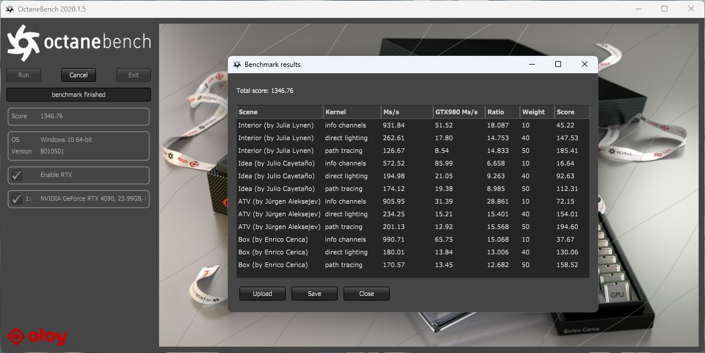

## はじめに

2024年2月、Ryzen Threadripper 7980X + RTX 4090の新ワークステーションを組みました。

今後3年程度、映像制作用途のメインマシンとして使用することになります。

スペック・ベンチマーク・パーツ選定の経緯などをまとめました。

## システム構成

```plaintext
CPU: AMD Ryzen Threadripper 7980X
M/B: ASUS Pro WS TRX50-SAGE WIFI
GPU: MSI GeForce RTX 4090 SUPRIM LIQUID X
RAM: Kingston 384GB (4x DDR5-5600 RDIMM ECC 96GB Micron Die)
SSD: 2x Nextorage 2TB NVMe SSD PCIe Gen5x4
PSU: SUPERFLOWER LEADEX VII GOLD 1300W
CPU_FAN: Arctic Freezer-4U-M
CHA: Geometric Future Model 4 Caliburn
CHA_FAN: 4x Thermaltake TOUGHFAN 12 Pro
```

## パーツ選定

### CPU

今回、ワークステーションを新調することにした理由は主に2つあります。1つは前回ワークステーションを組んでから3年が経過したこと、もう1つはRyzen Threadripperの新しいバージョンが登場したことです。

これまで使用していたRyzen 9 5950Xは、私のCGワークフローにおいては十分な性能を発揮していました。CPUレンダリングを行う機会は少なく、速度面で不足を感じることはほとんどありませんでした。しかし、PCIeレーン数と最大搭載可能メモリ量に制限があることが気になっていました。Ryzen 9 7000シリーズも同様で、これらの制限はコンシューマー向けCPUの壁とも言えるものです。

そのため、新しいRyzen Threadripperシリーズが登場したら購入することを、ほぼ決めていました。選択肢は7995WXと7980Xに絞られましたが、以下のような違いがあります：

|  | PRO 7995WX | 7980X |
| --- | --- | --- |
| 値段 | 180万円程度 | 90万円程度 |
| PCIeレーン | 128 | 48 |
| 最大メモリ | 2TB (256 **x8**) | 1TB (256 **x4**) |
| チップセット | WRX90 | TRX50 |
| ベンチスコア<br>(Cinebench R23 Multi Core) | 130000程度 | 100000程度 |

7995WXで構成すると7980Xの約2倍の費用がかかりますが、最も重視するパフォーマンスや拡張性の差は、価格差ほど大きくないと判断しました。そのため、コストパフォーマンスを考慮して7980Xを選択しました。


### メモリ

7980Xを選択したことで、メモリスロットが8枚ではなく4枚になったのは少し残念でした。当初は512GBのメモリを搭載する予定でしたが、1枚128GBのモジュールが国内で一般に流通していないことがわかりました。そこで、入手可能な最大容量である96GBのモジュールを4枚搭載することにしました。

Micron製のチップを使用したKingston製のモデルを選択しました。これは純正のMicron製モジュールと同等の性能を持ちながら、価格が比較的安かったためです。

なお、Threadripper用のメモリはDDR5ではありますが、コンシューマー向けのものとは異なり、エラー訂正機能（ECC）付きのRDIMMが必要です。通常のDDR5メモリは物理的に取り付けることができないので注意が必要です。

また、4枚のメモリを搭載する点ではコンシューマー向けCPUと同じように見えますが、動作モードが異なります。コンシューマー向けCPUでは2x2のデュアルチャンネルになりますが、Threadripperではクアッドチャンネルで動作します。

動作周波数は高めの5200MHzのものを選択しました。


### マザーボード

Ryzen Threadripper 7980X対応のマザーボードは、TRX50チップセットを搭載したものに限られます。WRX90チップセットのマザーボードでは動作しないので注意が必要です。

現在、日本国内で入手可能なTRX50マザーボードは、ASUS、ASRock、GIGABYTEの3社から発売されています。これらのマザーボードには、それぞれ特徴があります。

フォームファクターについては、ASUSのみがCEB（ATXをわずかに横に拡張したサイズ）を採用しており、ほとんどのATXケースに取り付け可能です。他の2社はEATXを採用しています。ASUSのコンパクトさは魅力的でした。

背面コネクタに関しては、全てのマザーボードが10GbEポートを搭載していますが、GIGABYTEのみがUSB4ポートを備えています。ASRockとASUSにはUSB4ポートはありませんが、ASRockは内部にThunderboltヘッダーを搭載しています。

最も注目すべき点は、PCIe x16スロットの配置が各マザーボードで異なることです。将来の拡張計画に応じて選択する必要があります。

私は、ASUSのマザーボードが2スロット厚のGPUを4枚搭載できる構成になっている点に惹かれました。また、フォームファクターがCEBでコンパクトかつスタイリッシュなデザインであることも決め手となりました。以前からASUSのワークステーション向けマザーボードに憧れていたこともあり、最終的にASUSのモデルを選択しました。


### CPUクーラー

今回選択したケースは、CPUクーラーの高さ制限が160mmとかなり厳しいものでした。Ryzen Threadripper 7980XはsTR5ソケットを採用しており、対応するクーラーはAMDのウェブサイトで確認できます。空冷を選択する方針だったため、Arctic Freezer 4U-Mを選びました。これはsTR5ソケット用では最もコンパクトな空冷クーラーの一つで、ヒートパイプが直接CPUに接触するデザインも魅力的でした。

ただし、このクーラーはファンがわずかに浮いた状態で取り付けることになります。完全に奥まで押し込もうとすると、マザーボードの電源部分と干渉してしまうためです。しかし、実用上は大きな問題にはならないと判断しました。


### ストレージ

ストレージには、PCIe 5.0対応のM.2 SSDを選択しました。まだ選択肢が限られている状況ですが、友人の推奨もあり、Nextorageの2TBモデルを選びました。ASUSのマザーボードにはPCIe 5.0対応のM.2スロットが2箇所あるため、2枚を搭載してRAID 0の4TB構成で運用しています。

RAID 0にすることで理論上は2倍の速度が出るはずですが、実際にはそこまでの向上は期待できません。しかし、単純に4TBの容量を確保しつつ、若干の速度向上が得られるのであれば十分だと考えました。

RAID 0は故障リスクが高いですが、私の場合は1日1回システムイメージをファイルサーバーにバックアップしているので、大きな問題にはなりません。


### GPU・ケース・電源

今回のビルドでは、可能な限り高性能なパーツをコンパクトなケースに収めることを目標としました。

ケースはGeometric Future Model 4を選択しました。このケースは外観のデザインが好みの分かれるところかもしれませんが、電源の搭載位置が特徴的です。通常はデッドスペースになりがちな場所に、最大180mmまでのATX電源を搭載できる設計になっています。これにより、ケース全体をコンパクトに仕上げることができる点が気に入りました。

GPUに関しては、将来的にはNVIDIAのRTXシリーズの最上位モデル（旧Quadroライン）を搭載する予定です。具体的には、NVIDIA RTX A6000 Adaの次世代モデルを想定しています。

私はGPUレンダリングを主に使用していますが、最近の課題はGPUの計算速度よりもVRAM容量の不足です。RTX 4090ではVRAM容量が十分ではないため、最終的には業務用GPUへのアップグレードを考えています。

しかし、現時点でRTX 6000 Adaを購入するのは時期尚早と判断し、一時的な選択としてRTX 4090を搭載することにしました。ケースのサイズ的には空冷の4090も搭載可能ですが、内部排気式のGPUだとCPUへの熱の影響が懸念されます。そこで、ケース上部に240mmのラジエーターを搭載できることを活かし、MSIのRTX 4090 SUPRIM LIQUID Xを選択しました。これにより、GPUの熱がCPUに影響を与えることを最小限に抑えられます。将来的にRTXシリーズの業務用GPUに更新する際も、ブロワー式ファンによる背面排気となるため、CPUへの熱の影響は少ないと予想しています。

電源については、システム全体で約800Wの消費電力を見込み、SUPER FLOWERの1200Wモデルを搭載しています。


>⚠️ なお、この記事を執筆している2024年2月現在、Ryzen Threadripper 7980Xやそれに対応するマザーボードは比較的新しい製品であり、日本国内で入手可能なパーツの種類も限られています。今後、新しいパーツが続々と登場すると予想されますので、ここで紹介した情報は現時点でのものであることにご留意ください。

## ベンチマーク

### Cinebench R23

CPU (Multi Core): 100153 pts


### Cinebench 2024

CPU (Multi Core): 5065 pts


### OctaneBench

Score: 1346.76



### CrystalDiskMark

Sequencial Read: 13163.59 MB/s
Sequencial Write: 19724.72 MB/s


## 温度パフォーマンス

10分間、CPUとGPUに同時に負荷をかけた状態で計測。
70℃以内で安定。


