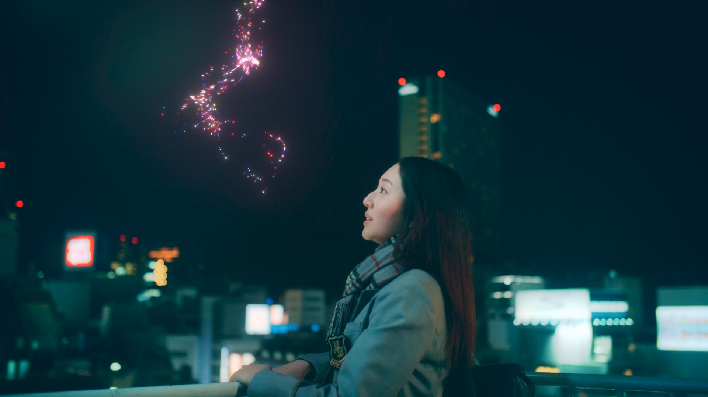

今年もお世話になりました！

上半期はMVの納品や広告案件などが重なり多忙だったものの、下半期には余裕ができ、今後のCumuloworksの方向性とか、仕事の進め方とか、諸々を整理して考える良い機会になりました。

2025年はそれをアウトプットできればと思っています。

ここからは、2024年の振り返り・近況報告を記していきたいと思います。

## 取り組んだ作品

2年ぶりにSHOWREELを制作しました。まずはご覧いただければと...!

<iframe style="border-radius:12px" src="https://www.youtube.com/embed/b_68zkrGBDQ?si=8888888888888888" title="YouTube video player" frameborder="0" allow="accelerometer; autoplay; clipboard-write; encrypted-media; gyroscope; picture-in-picture; web-share" referrerpolicy="strict-origin-when-cross-origin" allowfullscreen></iframe>

今年は、[花譜 4th ONE-MAN LIVE「怪歌」](/projects/kaf-kaika)から始まった記憶。

これに始まり、今年はVFX(実写合成)の案件が増えたと思います。

撮影素材の扱い・コンポジットのテクニックなど、ノウハウが蓄積されたように思います。

また、1年近くかけて制作していた[ヰ世界情緒 ANGELIC](/projects/angelic)のリリースは、Cumuloworks, Inc.のキャラクターCG領域における1つのマイルストーンになったと思います。

実は、別でもう1本MVを作っていたのですが、それはまた来年以降に。

他にも広告・イベントなど多様な案件を手掛けさせていただきました。

## 機材屋と化す

昨年、特にサーバーラックにLTOドライブが入ってからというもの、Cumuloworksの機材に興味を持っていただける機会が増えたと思います。

1月にはVookで弊社の[機材やワークフローについての詳しいインタビュー](/blogs/vook-backend)をしていただきました。

そのご縁があって、7月には[VIDEOGRAPHERS TOKYO 2024](/blogs/vgt2024)にて登壇しました。

さらには、そのときの自分のセッションにSynologyの社員の方が偶然いらしていて（！）、その流れで[NASの紹介](/blogs/vook-synology)をさせていただいたり、イベントへお呼びいただくなど、いろいろな機会が生まれました。

自分の興味のままに様々な機材やソフトウェアを集めては映像制作のフローに組み込んでいるわけですが、そこで得た情報は今後も対外的に発信していきたいなと思ったところです。

## パソコンを組みまくる

年初に、ワークステーションを3年ぶりに新調しました。

64コア128スレッドCPU、384GBメモリという、過去最高スペックになりました。

旧ワークステーションは小さく組み直しました。

他にも、友人のPCを3台組みました。

## コーディングにハマる

これまではせいぜいAfter Effectsスクリプトの開発くらいでしたが、本格的にWebアプリケーションの開発ができるようになったことが大きかったです。

[Cursor](https://www.cursor.com/)の導入、またChatGPTの精度向上で、かなり学習効率が上がりました。

コーディングそのものだけでなく、技術選定・設計・運用までの知識が実践的に身についた気がします。

### Webサイトの再構築

夏には[WebサイトをAstroで再構築](/blogs/website-astro)しました。

GitHubリポジトリにマークダウンを直接配置しCMSとして使う形で、更新が非常に楽になりました。

コンテンツのロードも爆速になったと思います。

### プロジェクト管理アプリ

これまで、プロジェクト管理にはNotionを使っていましたが、年々機能が複雑化。アプリケーションの動作も重くなっていてストレスを感じていました。

それに代わるソリューションをずっと探していましたが、最終的に自分で作ることにしました。

これまでNotion、LTOデータベース、Googleスプレッドシートなどで管理していたプロジェクト情報を、1つのデータベースで管理できるようになりました。

今後、ドキュメント・動画のレビュー・会計もこのアプリケーションに統合していきたいと思っています。

バックエンドはNodeJS、フロントエンドはSvelteを中心に構築しており、その中でOIDC認証、SQL、NoSQL(MongoDB)、REST API、WebSocket、CI/CDなど、いろいろな技術を試しながら実装しました。

ある程度使えるところまでは行ったので、今年の目標は達成...としたいかな。

来年は機能を仕上げつつ安定化をして、制作の基盤として本格的に導入できるようなものに仕上げていきたいと考えています。

## ワークフローのドキュメント化

他に、社内ドキュメントの整備に取り組みました。

社内で暗黙のルールになっていたファイルの命名規則やワークフローの取り決めを、明文化して直ぐに参照できるようにしました。

マークダウンで記述したものをGitHubリポジトリにまとめ、VitePressを使ってCloudflare Pagesでアクセス制御されたWebサイトとして公開される仕組みを整えました。

内容はまだ荒削りの状態ですが、今後さらに整えて、公開できるものは公開したいと考えています。

## 2025年

こうしてやってみると、結構いろいろやることあるなあ...

1月には大きなお知らせできるのでお楽しみに！

2025年も、Cumuloworksをよろしくお願いいたします。

おわり。

---

## ハマった音楽

<iframe style="border-radius:12px" src="https://open.spotify.com/embed/playlist/7FXIVqfVJ1mlvWN6I7z7Lz?utm_source=generator" width="100%" height="100%" frameBorder="0" allowfullscreen="" allow="autoplay; clipboard-write; encrypted-media; fullscreen; picture-in-picture" loading="lazy"></iframe>

Alex BoneのStuckがオシャレすぎて衝撃を受けた。Zeddがいきなりアルバムを出しててビビった。やっぱり2010年代のサウンドにハマるんだよなあ。

KMNZの再結成が驚いたし嬉しかった。LITAさんがどれだけ色々考えて苦労して2人を連れて再始動まで至ったんだろうと想像するとしびれる...。

## 買ったモノ・導入した機材

### SEQTRAK

可愛くて衝動買いしてしまったYAMAHAのシンセサイザー。

操作は少しむずかしいが、とても良く出来たプロダクトなので、オススメ。

### HermanMiller

頑張ったご褒美に、憧れのHermanMiller Cosm Chairを購入。

何の変哲もない椅子に見えて、めちゃくちゃ座り心地が良い。

### Keyboard Altar I

Electronic Materials OfficeのAltar Iというキーボード。1年越しに届いて、今のメインキーボードになった。

無機質なタイポグラフィとアクセントカラーがかっこいい。

## 行った場所

### イスタンブール

5年ぶり海外、トルコは10年ぶりの訪問

### 軽井沢

久しぶりに積もった雪を見た。友達6人でコテージ借りるという初の試み、めちゃめちゃ楽しかった。

### 羽田ANAハンガー

高校生ぶりに、整備場見学。多分結構ラッキーで、いろんなANAのフリートを見られて興奮。

### そのほか

4月には夜行バスで仙台に旅行したり（珍しく1人）、福岡に行ったり。

## 行ったライブ・展示

- 神椿代々木決戦二〇二四
- 神椿フェス
- HACHI forASTRA.
- Perfume Disco-Graphy : 25 Years of History and Miracles
