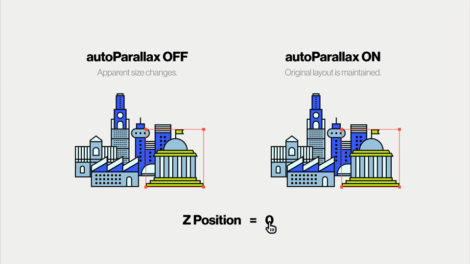
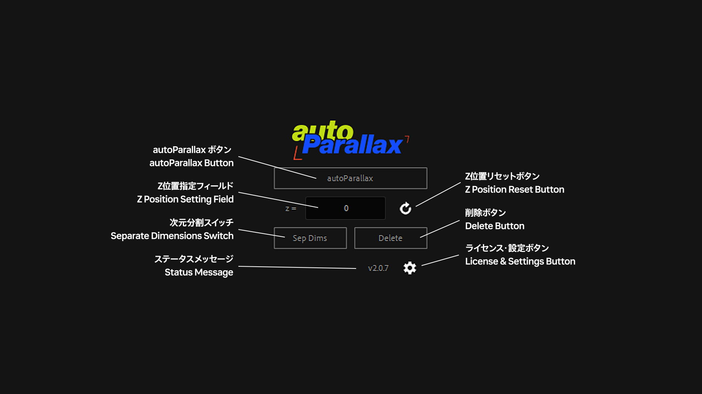

## autoParallaxとは

autoParallax 2は、After Effectsで3Dレイヤーを使ったパララックス効果のアニメーションを簡単に作成するスクリプトです。

初代に比べて、操作性と機能が向上しています。

After EffectsでZ座標を動かしたとき、通常は見かけのスケールが変わってしまいます。（近いものは大きく、遠いものは小さく）

スクリプトを使ってレイヤーにautoParallaxを加えると、見かけのサイズの変化がキャンセルされ、元のレイアウトを維持したままパララックス効果のアニメーションを作成できます。

60秒の説明動画を見て、どのように動作するかをご覧ください！

### autoParallax (初代) からのアップグレードは無料です

## Gumroadで購入した方のアップグレード方法

メールでお送りした100%ディスカウントコードを使って、autoParallax 2を新規購入・ダウンロードしてください。ライセンスキーがメールで送られてきます。

## BOOTHで購入した方のアップグレード方法

商品ページからv2をダウンロードして、注文番号を使ってライセンス認証してください。

## インストール

1. After Effectsを起動し、ファイル > スクリプト > ScriptUIパネルをインストール を選択。ダウンロードしたjsxbinファイルを選択します。
2. After Effectsを再起動してください。

## 初回起動・ライセンス認証

1. まず、環境設定の「スクリプトによるファイルへの書き込みとネットワークへのアクセスを許可」にチェックが入っていることを確認してください。
2. ウィンドウ > autoParallax2.jsxbinを選択します。

初回起動時はライセンスの入力が求められます。

Gumroadで購入した方 … 購入時にメールで送られてくるライセンスキーを入力してください。

BOOTHで購入した方 … 購入時にメールで送られてくる注文番号を入力してください。

E2, E4エラーでライセンス認証が失敗する場合、多くはセキュリティソフトが原因です。一時的に無効にしてお試しください。

## 各部名称

### autoParallaxボタン

ここをクリックすることで、選択したレイヤーにautoParallaxが適用されます。事前にアクティブなカメラを作っておく必要があります。

autoParallaxが適用不可能なレイヤーはスキップされ、スキップされたレイヤーはステータスメッセージに表示されます。

### Z位置設定フィールド

ここにautoParallax適用後のZ位置を設定できます。エクスプレッションの形式で入力することも可能で、例として

random(-1024, 512) (-1024から512の間でランダム配置)

(index-1) \* 200 (レイヤー番号1のものから順番に200間隔で配置)

1920 - sourceRectAtTime().width (見かけの幅が小さいレイヤーほど奥に配置)

などが可能です。

### Z位置リセットボタン

ここをクリックすることで、Z位置設定フィールドに入力した内容をリセットすることができます。

Shiftを押しながらクリックすることで、現在Z位置設定フィールドに入力されている内容をデフォルトとして設定します。

### 次元分割スイッチ

ここをクリックすることで、レイヤーの位置の次元分割を切り替えます。

位置にエクスプレッションが入力されている場合…

次元分割 OFF → ON … 位置のエクスプレッションが、X位置・Y位置にコピーされます。

次元分割 ON → OFF … X位置のエクスプレッションが、位置にコピーされます。

複数選択時、Shiftを押しながらクリックすることで現在の状態を反転します。

次元分割が不可能なレイヤーはスキップされ、スキップされたレイヤーはステータスメッセージに表示されます。

### 削除ボタン

autoParallaxボタンで適用したautoParallaxを削除します。

autoParallaxではないレイヤーはスキップされ、スキップされたレイヤーはステータスメッセージに表示されます。

### ステータスメッセージ

エラーやステータスの表示は、ここに表示されます。

ライセンス表示に関するエラーの一覧

Activation Failure (E0) … 入力したライセンスキーの形式が違います。

Activation Failure (E1) … Gumroadのライセンスキーが間違っています。

Activation Failure (E2) … Gumroadのライセンスキーの問い合わせに失敗しました。

Activation Failure (E3) … Boothの注文番号が間違っています。

Activation Failure (E4) … Boothの注文番号の問い合わせに失敗しました。

### 設定ボタン

将来、ここにautoParallaxの設定が追加されます。

Shiftを押しながらクリックすることで、ライセンスキー入力の画面を強制的に表示させることができます。
