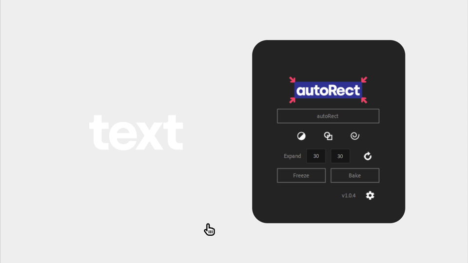
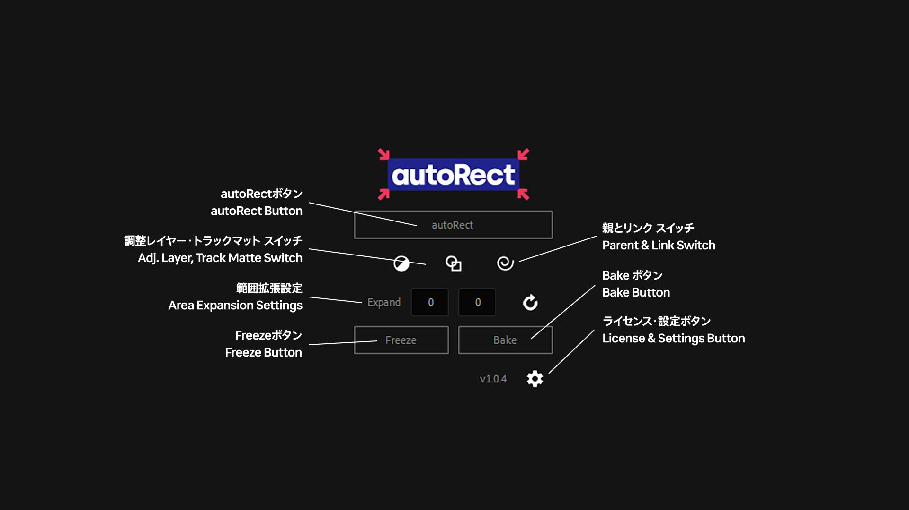
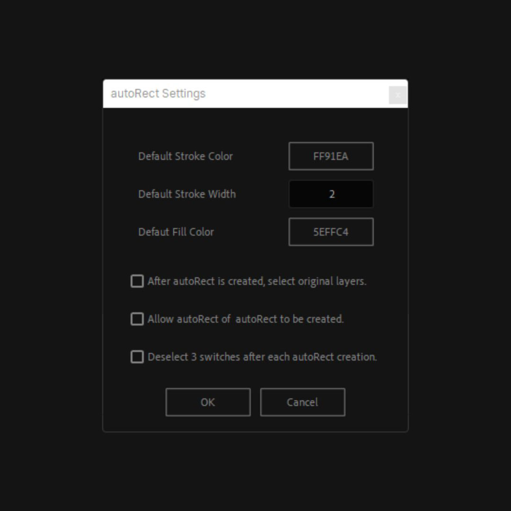
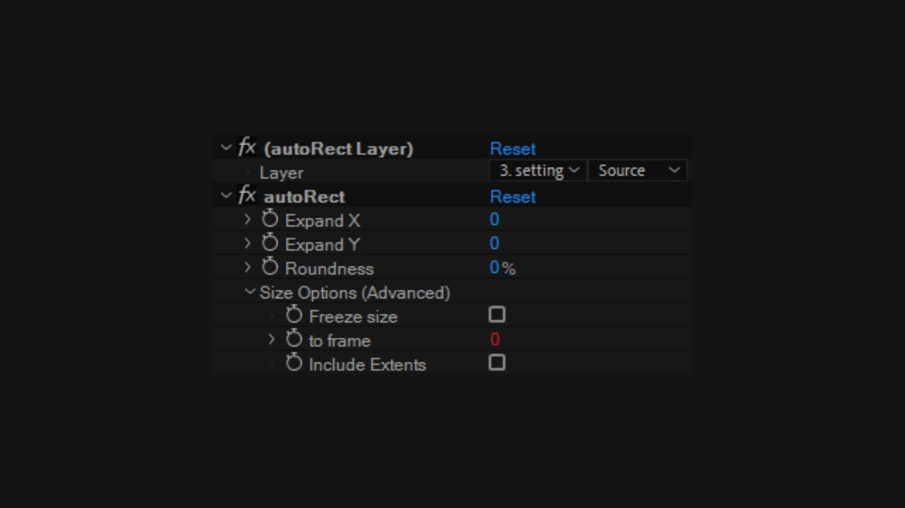

autoRectは、After Effectsで選択したレイヤーにマッチしたサイズのシェイプレイヤーをワンクリックで作成できるスクリプトです。

以前までFit Shapeという名前でリリースしていたスクリプトで、autoRectでは操作性と機能性が向上しています。

テキストボックス、フッテージの枠、トラックマットの作成など、普段のワークフローの中の様々な場面で役に立ちます。

autoRectはプラグインではなく、数行のエクスプレッションが適用された普通のシェイプレイヤーなので、AEPの共有がしやすく拡張性が高いのが特徴です。

60秒の説明動画を見て、どのように動作するかをご覧ください！

Fit Shape からの## アップグレードは無料です。

Gumroadで購入した方のアップグレード方法

メールでお送りした100%ディスカウントコードを使って、autoRectを新規購入・ダウンロードしてください。ライセンスキーがメールで送られてきます。

BOOTHで購入した方のアップグレード方法

商品ページからautoRectをダウンロードして、注文番号を使ってライセンス認証してください。

インストール

1. After Effectsを起動し、ファイル > スクリプト > ScriptUIパネルをインストール を選択。ダウンロードしたjsxbinファイルを選択します。
2. After Effectsを再起動してください。

初回起動・ライセンス認証

1. まず、環境設定の「スクリプトによるファイルへの書き込みとネットワークへのアクセスを許可」にチェックが入っていることを確認してください。
2. ウィンドウ > autoRect.jsxbinを選択します。

初回起動時はライセンスの入力が求められます。

Gumroadで購入した方 … 購入時にメールで送られてくるライセンスキーを入力してください。

BOOTHで購入した方 … 購入時にメールで送られてくる注文番号を入力してください。

各部名称

## autoRectボタン

このボタンをクリックすると、選択しているレイヤーの下に同サイズのシェイプレイヤーが作成されます。（調整レイヤー・トラックマットスイッチが両方オフの場合）

シェイプレイヤーにはautoRect pseudoエフェクトが追加され、範囲拡張・角丸の設定などが行なえます。

Shift+クリックで、選択しているレイヤーの上にシェイプレイヤーを作成します。

autoRectを作成できないレイヤーはスキップされ、スキップされたレイヤーはステータスメッセージに表示されます。

## 調整レイヤー スイッチ

このスイッチがONのときにautoRectボタンを押すと、選択しているレイヤーの上にautoRectが作成され、調整レイヤーになります。

## トラックマット スイッチ

このスイッチがONのときにautoRectボタンをクリックすると、選択しているレイヤーの上にautoRectが作成され、選択していたレイヤーのアルファマットに設定されます。

## 親とリンク スイッチ

このスイッチがONのときにautoRectを作成すると、選択していたレイヤーの子に設定されます。

## 範囲拡張設定

作成するautoRectの範囲拡張を設定します。範囲拡張は、autoRect pseudoエフェクトから作成後でも変更できます。

右側のリセットボタンをクリックすることで、デフォルトの値にリセットします。 リセットボタンをShift+クリックすると、現在入力されている値をデフォルトとして設定します。

## Freezeボタン

autoRectするレイヤーのサイズが変化する場合(例えば、テキストがアニメーションしている場合）、現在の時間のサイズに固定することができます。マーカーが作成され、そのタイミングで固定されます。もう一度クリックすると、固定を解除できます。

autoRectではないレイヤーはスキップされ、スキップされたレイヤーはステータスメッセージに表示されます。

## Bakeボタン

このボタンをクリックすると、autoRectが現在の状態で通常のシェイプレイヤーに変換されます。

autoRectではないレイヤーはスキップされ、スキップされたレイヤーはステータスメッセージに表示されます。

## ライセンス・設定ボタン

クリックしてautoRectの設定を開きます。

Shift+クリックすることで、ライセンスキー入力画面を強制的に表示させます。

## ステータスメッセージ

エラーやステータスの表示は、ここに表示されます。

ライセンス表示に関するエラーの一覧

Activation Failure (E0) … 入力したライセンスキーの形式が違います。

Activation Failure (E1) … Gumroadのライセンスキーが間違っています。

Activation Failure (E2) … Gumroadのライセンスキーの問い合わせに失敗しました。

Activation Failure (E3) … Boothの注文番号が間違っています。

Activation Failure (E4) … Boothの注文番号の問い合わせに失敗しました。

Layer X, skipped. (E11) … レイヤーXはautoRectを作成できないレイヤーです。（例: 音声レイヤー、カメラレイヤー、ライトレイヤー）

Layer X, skipped. (E12) … レイヤーXはautoRectではないので、Freezeボタンは使えません。

Layer X, skipped. (E13) … レイヤーXはautoRectではないので、Bakeボタンは使えません。

## Settings Panel | 設定画面

Default Stroke Color, Default Stroke Width, Default Fill Color

Set default value for stroke color, stroke width, fill color.

デフォルトの線カラー・線幅・塗りのカラーが変更できます。

After autoRect is created, select original layers..

After creating an autoRect, toggles whether selecting the created autoRect (OFF) or selecting the original layer (ON).

autoRect作成後、作成したautoRectを選択した状態にするか(OFF)、元のレイヤーを選択した状態にするか(ON)を切り替えます。

Allow autoRect of autoRect to be created.

Toggles whether preventing (OFF) or allowing (ON) an autoRect to be created for an autoRect.

autoRectに対してautoRectが作成されるのを禁止するか(OFF)、許可するか(ON)を切り替えます。

Deselect 3 switches after each autoRect creation.

Toggles whether the adjustment layer switch, track matte switch, and parent and link switches are to be maintained (OFF) or turned off each time (ON) after autoRect is created.

autoRect作成後、調整レイヤースイッチ・トラックマットスイッチ・親とリンクスイッチの状態を維持するか(OFF)、毎回OFFにするか(ON)を切り替えます。

## autoRect pseudo effect | autoRect pseudoエフェクト

Expand X

Set area expansion in the X direction in pixel.

横方向の範囲拡張をpx単位で指定します。

Expand Y

Set area expansion in the Y direction in pixel.

縦方向の範囲拡張をpx単位で指定します。

Roundness

Set roundness in 0-100%

角丸を0~100%の間で設定します。

Freeze Size

This parameter is set internally when Freeze button is used.

Freezeボタン使用時に内部的に設定されるパラメーターです。

to frame

This parameter is set internally when Freeze button is used.

Freezeボタン使用時に内部的に設定されるパラメーターです。

Include Extents

Toggles whether to include extents, primarily for paragraph text.

主に段落テキストにおいて、余白部分を対象にするかどうかを切り替えます。

(see: [Layer Sub-objects — After Effects Expression Reference 0.0.3 documentation (](https://ae-expressions.docsforadobe.dev/layer-sub.html#layer-sourcerectattime-t-time-includeextents-false)[docsforadobe.dev](http://docsforadobe.dev)[)](https://ae-expressions.docsforadobe.dev/layer-sub.html#layer-sourcerectattime-t-time-includeextents-false)
