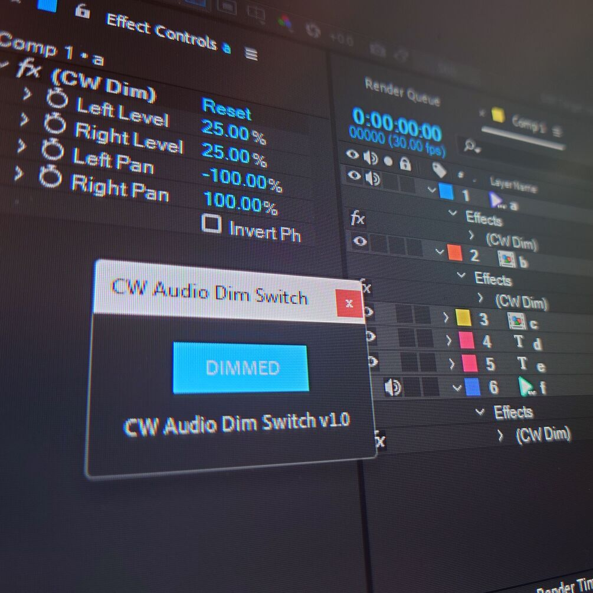

# CW Dim Switch

AE does not have that wonderful switch DaVinci Resolve has. So, me, Cumuloworks made it for you. You're welcome!

I made this in 30 minutes, so it may have some bugs. Use at your own risk! (and let me know if you find any)

*   How it works?
    
    Pressing the DIM switch adds a stereo mixer effect named "CW Dim" to all layers containing audio, and sets the audio level to 20%.
    
    Pressing again removes the added effects and returns it to its original state.
    
    Dimming will also affect the rendering! So don't forget to undim before rendering.
    
*   What happens if I manually delete an added 'CW Dim' effect?
    
    Basically, there is no problem. Of course, the current state will temporarily not match the display of the switch, but it will return to normal after a few more clicks.
    
*   What happens if the layer already has the stereo mixer effect I added?
    
    It works fine. This script will only affect effects with names that exactly match "(CW Dim)".
    
*   What are the rules for using this script?
    
    None in particular. Redistributing is prohibited. And use this at your own risk.
    
    
    

AEには、DaVinci Resolveにある素晴らしいDIMスイッチはありません。そこで、私、Cumuloworksが作ってあげました。どういたしまして。

30分で作ったので、バグがあるかもしれません。自己責任でお願いします。(見つけたら教えてください。）

*   どのように機能するのか？

DIMスイッチを押すと、オーディオを含むすべてのレイヤーに「CW Dim」という名前のステレオミキサーエフェクトが追加され、オーディオレベルが20%に設定されます。

もう一度押すと、追加されたエフェクトが解除され、元の状態に戻ります。

ディミングはレンダリングにも影響します! ですから、レンダリング前にディムを解除することを忘れないでください。

*   追加した'CW Dim'エフェクトを手動で削除するとどうなりますか？

基本的には問題ありません。もちろん、現在の状態は一時的にスイッチの表示と一致しなくなりますが、さらに数回クリックすると元に戻ります。

*   追加したステレオミキサーエフェクトが既にレイヤーにある場合はどうなりますか？

問題なく動作します。このスクリプトは、「(CW Dim)」と完全に一致する名前のエフェクトにのみ作用します。

*   このスクリプトを使用する際のルールはありますか？

特にありません。再配布は禁止です。また、自己責任で使用してください。

