

## イラストレーター天野さほによって描かれた、360度パノラマHDRI

通常のHDRIのように設定するだけで、背景としても照明としても使用できます。

Vol.1のフルバージョンには8K解像度の'sunny', 'coldfront', 'overcast', 'aurora', 'sunset', 'drawing'の6種類が収録されています。

[Gumroadにてsunnyの4Kが収録された無料バージョンを入手できます](https://cumuloworks.gumroad.com/l/cwhdrivol1)

ほとんどのCGソフトやレンダラーで使用できます。サンプルはCinema 4D用のOctaneRenderでレンダリングされています。

## ルール

商用・非商用に関わらず使用可能です。

制作物に合わせて改変することができます。

再配布は禁止です。

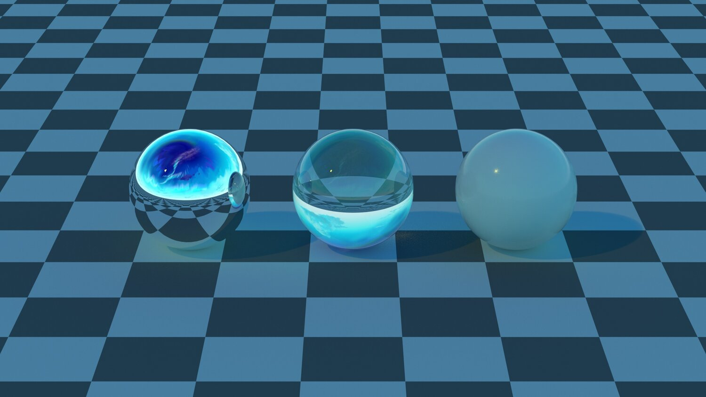
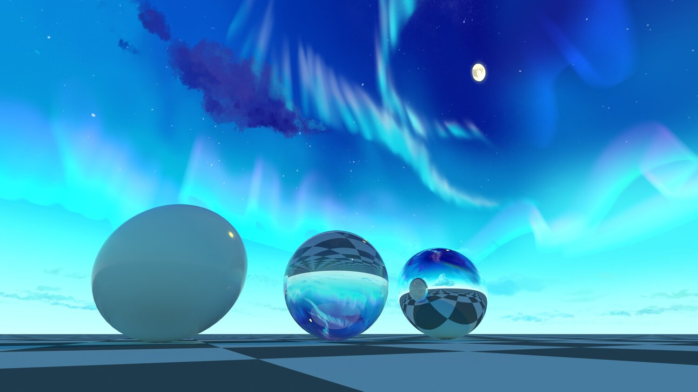

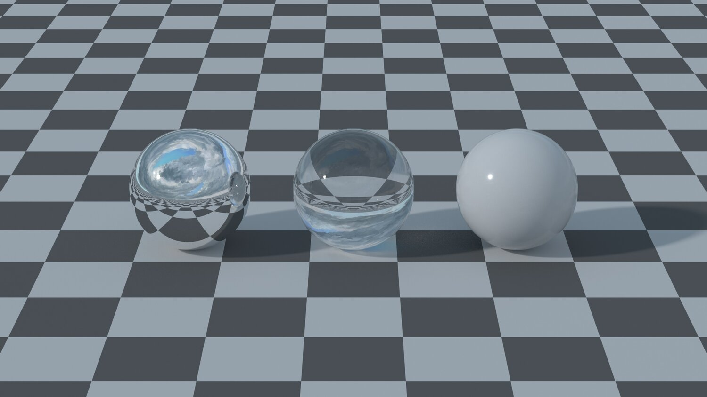
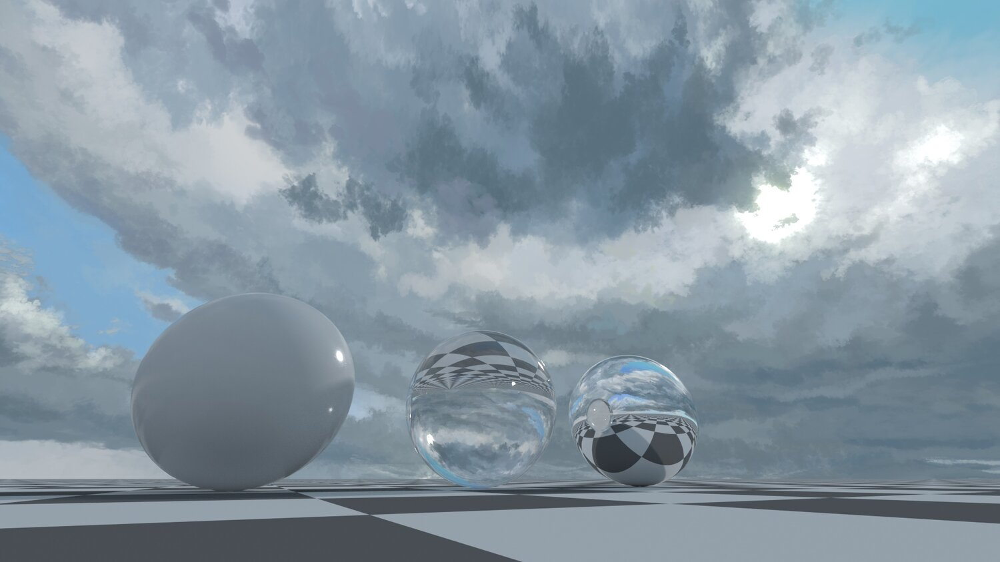
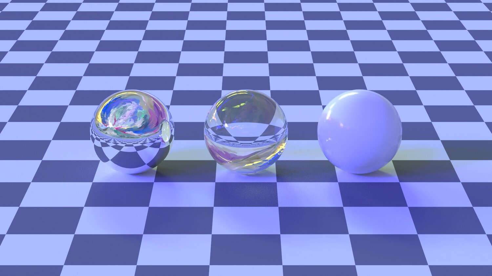

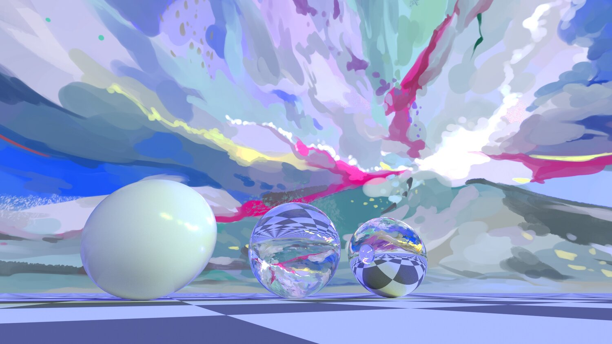
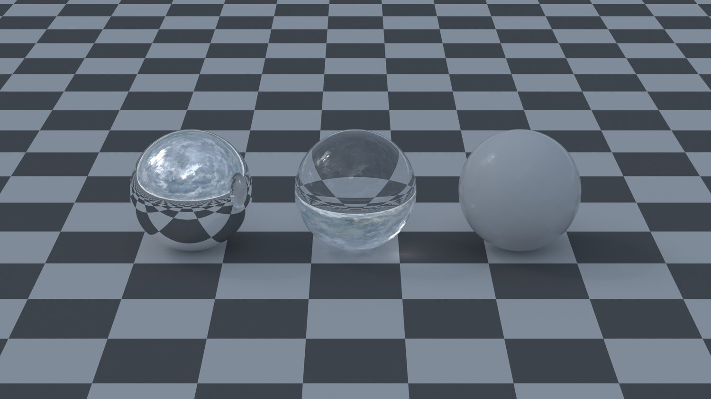

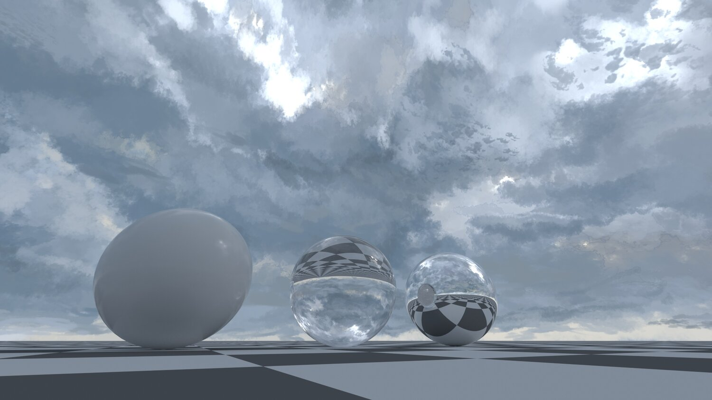
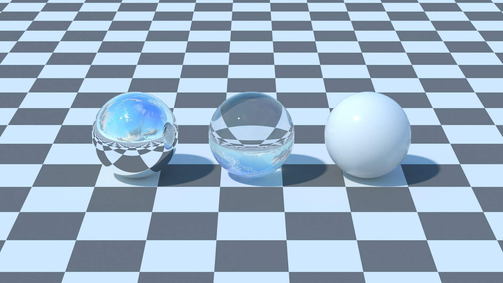
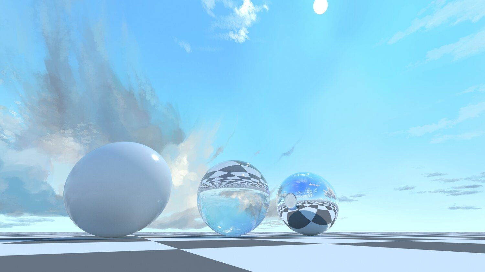

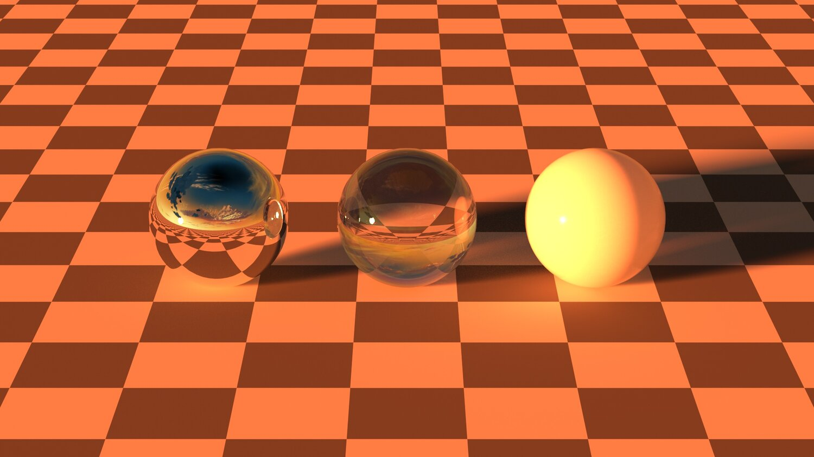
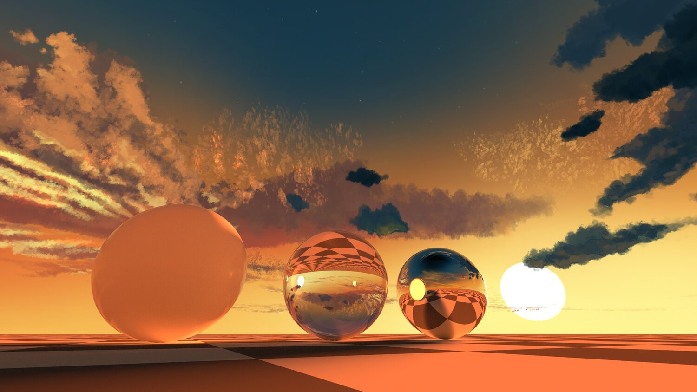
