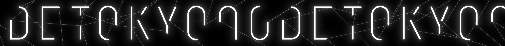

# TOKYO NODE Digital Signage

TOKYO NODE サイネージロゴモーションをNANAME.INCと制作しました。

主にAfter Effectsでの動的なグラフィック生成の開発を行いました。





```plaintext
Client: Mori Building Co., Ltd.
Production: NANAME INC. + Bascule Inc.
Producer: Shunsuke Murakami (NANAME INC.), Sho Torii
Supervisor: Yugo Nakamura 
Creative Director: Kampei Baba
Production Manager: Kenichi Oikawa (NANAME INC.), Tatsuru Takeishi
Motion Graphics Director: Kazuhiro Hata (NANAME INC.)
Motion Grapher: Kaito Mochida (NANAME INC.), Tomoya Eguchi (Cumuloworks, Inc.)
Designer: Momoko Hashino (NANAME INC.)
```
